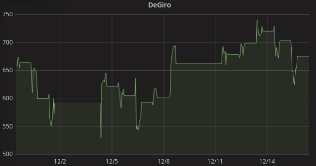

I was interested in monitoring the growth of my stock portfolio at DeGiro. After googling a bit I learned it was possible to get the data I was interested in using a few simple HTTP GET/POST requests. I got inspired by the Node.JS [unofficial API](https://github.com/pladaria/degiro) and decided to make my own API using Python. After peering at the network monitor output of the web developer tools for some time I was able to quickly cook up a [Pyton based API](https://github.com/bramton/degiro).

Next step was to add a crontab entry to retreive the current portfolio value every hour during working days and hours:
```
00 9-17 * * 1-5 bram python3.6 /home/bram/degiro/giro-log.py
```

For my visualisations I use a combination of Grafana and InfluxDB. Getting data from scripts into InfluxDB is a piece of cake:
``` python
# Send data to the InfluxDB
url = 'http://localhost:8086/write?db=degiro'
data = 'pf_summary cash={:.2f},equity={:.2f}'.format(pfs['cash'], pfs['equity'])
res = requests.post(url=url, data=data)
```
And the final result:


